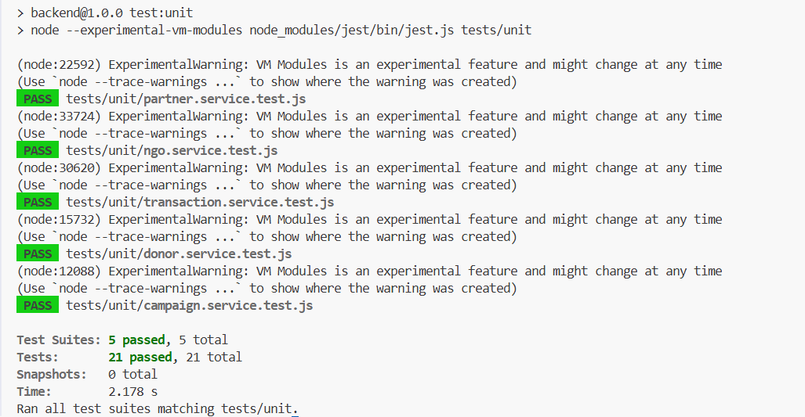
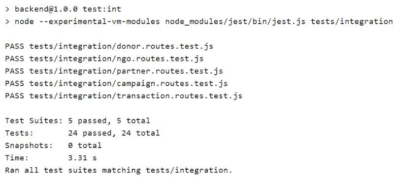

# Testing Instruction Report

This document contains the full testing guide for TransFund, including setup, execution commands, and environment configuration.

## Scope

- Unit testing (Jest)
- Integration testing (Jest + Supertest)
- Performance testing (Artillery)

## 1) Testing Environment Configuration

### Prerequisites

- Node.js 18+
- npm 9+
- Backend dependencies installed:

```bash
cd backend
npm install
```

### Runtime/Target Ports

- Backend server default runtime is controlled by `PORT` in `backend/.env`.
- Artillery performance target is set to `http://localhost:3000` in `backend/tests/performance/load-test.yml`.

### Core Test Config Files

- Jest config: `backend/jest.config.js`
- Performance scenario: `backend/tests/performance/load-test.yml`

## 2) Unit Testing Setup and Execution

Unit tests validate service-level business logic in isolation.

### Run

```bash
cd backend
npm run test:unit
```

### Current Coverage Focus

- Donor service
- Campaign service
- Transaction service
- NGO service
- Partner service

### Screenshot

The unit testing screenshot is stored in `docs/deployment/screenshots/testing`.



## 3) Integration Testing Setup and Execution

Integration tests verify API routes, middleware, and request/response behavior.

### Run

```bash
cd backend
npm run test:int
```

### Notes

- Uses Jest with Supertest-style route testing.
- Includes role/middleware behavior validation (including expected `403` role-block flows).

### Screenshot

The integration testing screenshot is stored in `docs/deployment/screenshots/testing`.



## 4) Performance Testing Setup and Execution

Performance tests use Artillery with phased traffic.

### Setup

1. Ensure backend is running on `http://localhost:3000`.
2. Confirm `backend/tests/performance/load-test.yml` target matches your running server.

### Run

```bash
cd backend
npm run test:perf
```

### Load Profile (Current)

- Warm up: 20s at 5 arrivals/sec
- Ramp up: 40s from 5 to 50 arrivals/sec
- Sustained load: 60s at 50 arrivals/sec

## 5) Reproducible Test Run Sequence

Use this sequence for a fresh local verification cycle:

```bash
cd backend
npm install
npm run test:unit
npm run test:int
npm start
# In a second terminal:
npm run test:perf
```
